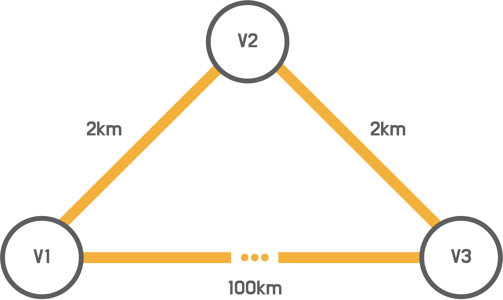

# 지하철 노선도 경로 조회 미션
- 등록된 지하철 노선도에서 경로를 조회하는 기능을 구현한다.

<br>

## 🚀 기능 요구사항

> 프리코스 3주차 미션에서 사용한 코드를 참고해도 무관하다. 

### 초기 설정 
- 프로그램 시작 시 역, 노선, 구간 정보를 초기 설정 해야 한다.
- 거리와 소요 시간은 양의 정수이며 단위는 km와 분을 의미한다.
- 아래의 사전 등록 정보로 반드시 초기 설정을 한다.

```
 1. 지하철역으로 교대역, 강남역, 역삼역, 남부터미널역, 양재역, 양재시민의숲역, 매봉역이 등록되어 있다.
 2. 지하철 노선으로 2호선, 3호선, 신분당선이 등록되어 있다.
 3. 노선에 역이 아래와 같이 등록되어 있다.(왼쪽 끝이 상행 종점)
   - 2호선: 교대역 - ( 2km / 3분 ) - 강남역 - ( 2km / 3분 ) - 역삼역
   - 3호선: 교대역 - ( 3km / 2분 ) - 남부터미널역 - ( 6km / 5분 ) - 양재역 - ( 1km / 1분 ) - 매봉역
   - 신분당선: 강남역 - ( 2km / 8분 ) - 양재역 - ( 10km / 3분 ) - 양재시민의숲역
 ```
  
### 경로 조회 기능
- 출발역과 도착역을 입력받아 경로를 조회한다.
- 경로 조회 시 총 거리, 총 소요 시간도 함께 출력한다.
- 경로 조회 기준은 `최단 거리` `최소 시간`이 있다.

### 예외 처리
- 경로 조회 시 출발역과 도착역이 같으면 에러를 출력한다.
- 경로 조회 시 출발역과 도착역이 연결되어 있지 않으면 에러를 출력한다.
- 그 외 정상적으로 프로그램이 수행되지 않은 경우 에러를 출력한다.

<br>

## ✍🏻 입출력 요구사항
- `프로그래밍 실행 결과 예시`와 동일하게 입출력을 구현한다.
- 기대하는 출력 결과는 `[INFO]`를 붙여서 출력한다. 출력값의 형식은 예시와 동일하게 한다.
- 에러 발생 시 `[ERROR]`를 붙여서 출력한다. 에러의 문구는 자유롭게 작성한다.

### 💻 프로그래밍 실행 결과 예시
#### 경로 조회
```
## 메인 화면
1. 경로 조회
Q. 종료

## 원하는 기능을 선택하세요.
1

## 경로 기준
1. 최단 거리
2. 최소 시간
B. 돌아가기

## 원하는 기능을 선택하세요.
1

## 출발역을 입력하세요.
교대역

## 도착역을 입력하세요.
양재역

## 조회 결과
[INFO] ---
[INFO] 총 거리: 4km
[INFO] 총 소요 시간: 11분
[INFO] ---
[INFO] 교대역
[INFO] 강남역
[INFO] 양재역

## 메인 화면
1. 경로 조회
Q. 종료

...
```

#### 에러 출력 예시

```
## 메인 화면
1. 경로 조회
Q. 종료

## 원하는 기능을 선택하세요.
1

## 경로 기준
1. 최단 거리
2. 최소 시간 
B. 돌아가기

## 원하는 기능을 선택하세요.
1

## 출발역을 입력하세요.
강남역

## 도착역을 입력하세요.
강남역

[ERROR] 출발역과 도착역이 동일합니다.

## 경로 기준
1. 최단 거리
2. 최소 시간 
B. 돌아가기

## 원하는 기능을 선택하세요.

...

```

<br>

## 🎱 프로그래밍 요구사항
- 자바 코드 컨벤션을 지키면서 프로그래밍한다.
  - 기본적으로 [Google Java Style Guide](https://google.github.io/styleguide/javaguide.html)을 원칙으로 한다.
  - 단, 들여쓰기는 '2 spaces'가 아닌 '4 spaces'로 한다.
- indent(인덴트, 들여쓰기) depth를 3이 넘지 않도록 구현한다. 2까지만 허용한다.
  - 예를 들어 while문 안에 if문이 있으면 들여쓰기는 2이다.
  - 힌트: indent(인덴트, 들여쓰기) depth를 줄이는 좋은 방법은 함수(또는 메소드)를 분리하면 된다.
- 3항 연산자를 쓰지 않는다.
- 함수(또는 메소드)의 길이가 15라인을 넘어가지 않도록 구현한다.
  - 함수(또는 메소드)가 한 가지 일만 잘 하도록 구현한다.
- else 예약어를 쓰지 않는다.
  - 힌트: if 조건절에서 값을 return하는 방식으로 구현하면 else를 사용하지 않아도 된다.
  - else를 쓰지 말라고 하니 switch/case로 구현하는 경우가 있는데 switch/case도 허용하지 않는다.
- 프로그래밍 요구사항에서 별도로 변경 불가 안내가 없는 경우 파일 수정과 패키지 이동을 자유롭게 할 수 있다.
- 예외 상황 시 에러 문구를 출력해야 한다. 단, 에러 문구는 `[ERROR]` 로 시작해야 한다.

### 프로그래밍 요구사항 - Application
- Application 클래스를 활용해 구현해야 한다.
- Application의 패키지 구조는 변경하지 않는다.
- Application 클래스에 있는 Scanner를 사용하고 별도의 Scanner 객체를 만들지 않는다.
```java
public class Application {
    public static void main(String[] args) {
        final Scanner scanner = new Scanner(System.in);
        ...
    }
}
```

### 프로그래밍 요구사항 - Station, Line
- Station, Line 클래스를 활용하여 지하철역과 노선을 구현해야 한다.
- 제공하는 각 클래스의 기본 생성자를 추가할 수 없다.
- 필드(인스턴스 변수)인 name의 접근 제어자 private을 변경할 수 없다.
- 가능하면 setter 메소드(ex. setXXX)를 추가하지 않고 구현한다.
 
```java
public class Station {
    private String name;

    public Station(String name) {
        this.name = name;
    }

    public String getName() {
        return name;
    }

    // 추가 기능 구현
}

```

### 프로그래밍 요구사항 - StationRepository, LineRepository
- Station과 Line의 상태를 저장할 수 있는 StationRepository, LineRepository를 제공한다.
- 필요 시 StationRepository, LineRepository 이 외 추가로 Repository를 만들 수 있다.
- 추가로 생성되는 객체에 대해서 XXXRepository 네이밍으로 저장 클래스를 추가한다.
- 객체들의 상태를 관리하기 위해서 XXXRepository 클래스를 활용해 저장 로직을 구현해야 한다.
- 작성된 메서드는 수정할 수 없고, 필요에 따라 메서드를 자유롭게 추가할 수 있다.
 
```java
public class StationRepository {
    private static final List<Station> stations = new ArrayList<>();

    public static List<Station> stations() {
        return Collections.unmodifiableList(stations);
    }

    public static void addStation(Station station) {
        stations.add(station);
    }

    public static boolean deleteStation(String name) {
        return stations.removeIf(station -> Objects.equals(station.getName(), name));
    }

    public static void deleteAll() {
        stations.clear();
    }
}
```

<br>

## ❗️힌트
### 최단 경로 라이브러리
- jgrapht 라이브러리를 활용하면 간편하게 최단거리를 조회할 수 있음
- Dijkstra 알고리즘을 반드시 이해할 필요는 없고 미션에 적용할 정도로만 이해하면 됨
- JGraphtTest 클래스의 테스트를 활용하여 미션에 필요한 라이브러리의 기능을 학습할 수 있음 
- 정점(vertex)과 간선(edge), 그리고 가중치 개념을 이용
  - 정점: 지하철역
  - 간선: 지하철역 연결정보
  - 가중치: 거리 or 소요 시간
- 최단 거리 기준 조회 시 가중치를 거리로 설정

```java
@Test
public void getDijkstraShortestPath() {
    WeightedMultigraph<String, DefaultWeightedEdge> graph
            = new WeightedMultigraph(DefaultWeightedEdge.class);
    graph.addVertex("v1");
    graph.addVertex("v2");
    graph.addVertex("v3");
    graph.setEdgeWeight(graph.addEdge("v1", "v2"), 2);
    graph.setEdgeWeight(graph.addEdge("v2", "v3"), 2);
    graph.setEdgeWeight(graph.addEdge("v1", "v3"), 100);

    DijkstraShortestPath dijkstraShortestPath = new DijkstraShortestPath(graph);
    List<String> shortestPath = dijkstraShortestPath.getPath("v3", "v1").getVertexList();

    assertThat(shortestPath.size()).isEqualTo(3);
}
```

#### 테스트 설명



- 역 사이의 거리를 고려하지 않는 경우 V1->V3 경로가 최단 경로
- 역 사이의 거리를 고려할 경우 V1->V3 경로의 거리는 100km, V1->V2->V3 경로의 거리는 4km이므로 최단 경로는 V1->V2->V3

<br>

## 📈 진행 요구사항
- 미션은 [java-subway-path-precourse 저장소](https://github.com/woowacourse/java-subway-path-precourse) 를 fork/clone해 시작한다.
- 기능을 구현하기 전에 java-subway-path-precourse/docs/README.md 파일에 구현할 기능 목록을 정리해 추가한다.
- git의 commit 단위는 앞 단계에서 README.md 파일에 정리한 기능 목록 단위로 추가한다.
  - [AngularJS Commit Message Conventions](https://gist.github.com/stephenparish/9941e89d80e2bc58a153) 참고해 commit log를 남긴다.
- [프리코스 과제 제출 문서](https://github.com/woowacourse/woowacourse-docs/tree/master/precourse) 절차를 따라 미션을 제출한다.
  - [프리코스 과제 FAQ](https://github.com/woowacourse/woowacourse-docs/tree/master/precourse/faq) 문서를 참고하여 진행할 수 있다.
<br>

## 📝 License

This project is [MIT](https://github.com/woowacourse/java-subway-path-precourse/blob/master/LICENSE.md) licensed.
